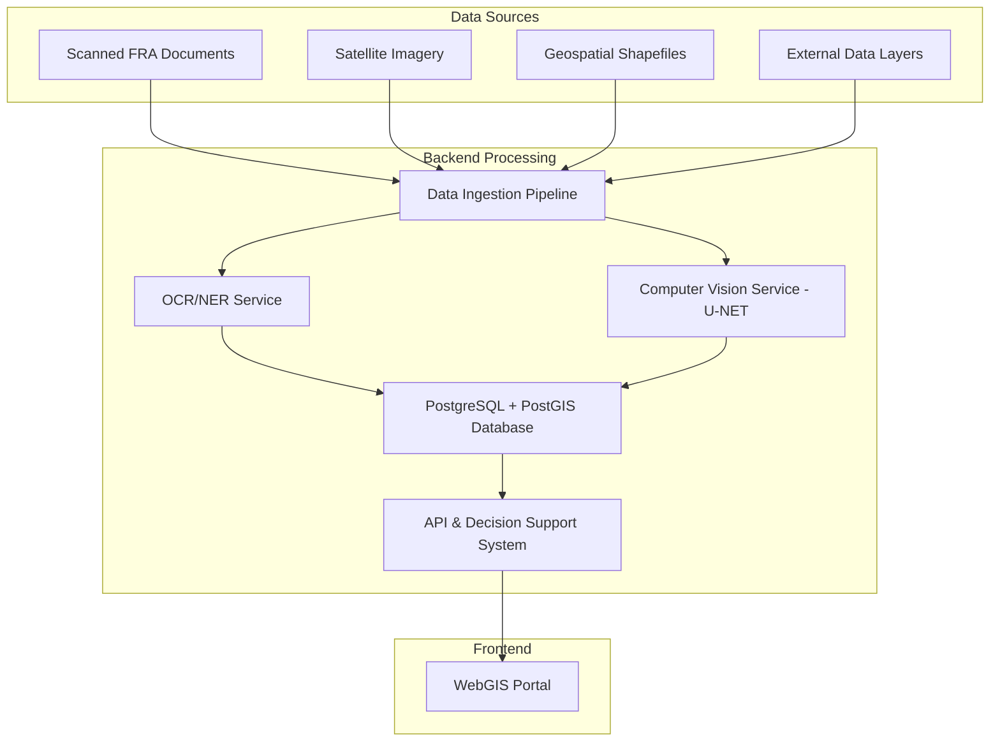

# AI-powered FRA Atlas and Decision Support System

## Project Vision

This project aims to revolutionize the implementation and monitoring of the Forest Rights Act (FRA), 2006, by developing an AI-powered FRA Atlas and a WebGIS-based Decision Support System (DSS). The system will digitize legacy records, visualize FRA claims and granted titles, integrate satellite-based asset mapping, and provide actionable insights for targeted development through Central Sector Schemes (CSS).

## Problem Statement

The Forest Rights Act (FRA), 2006, faces significant challenges in its implementation:
*   **Scattered and Non-Digitized Records:** Legacy records (IFR, CR, CFR) are fragmented, non-digitized, and difficult to verify.
*   **Lack of Centralized Repository:** There is no real-time visual repository (FRA Atlas) of FRA claims and granted titles.
*   **Missing Data Integration:** Integration of satellite-based asset mapping with FRA data, and legacy data with the FRA Atlas, is absent.
*   **Absence of Decision Support:** Decision-makers lack a DSS to layer CSS benefits (e.g., PM-KISAN, Jal Jeevan Mission, MGNREGA, DAJGUA) for FRA patta holders.

## Objectives

1.  **Digitize and Standardize Legacy Data:** Digitize and integrate legacy FRA claims, verifications, and pattas with the FRA Atlas, including FRA patta holders’ shapefiles.
2.  **Create an FRA Atlas:** Develop an FRA Atlas showing potential and granted FRA areas using AI and satellite data.
3.  **Integrate WebGIS Portal:** Implement a WebGIS portal for visualizing and managing spatial and socio-economic data.
4.  **AI-based Asset Mapping:** Utilize Remote Sensing and AI/ML to map capital and social assets (ponds, farms, forest resources) in FRA-holding villages.
5.  **Build a Decision Support System (DSS):** Create a DSS to recommend and layer CSS schemes based on mapped data, facilitating targeted development.

## High-Level Architecture

## Technology Stack

*   **Programming Language:** Python 3.9+
*   **Web Framework:** FastAPI (for high-performance APIs) or Django
*   **Database:** PostgreSQL with PostGIS extension (Primary/Geospatial), MongoDB or Elasticsearch (Optional, for document store)
*   **AI/ML Libraries:**
    *   **OCR/NER:** PyTesseract, spaCy, Hugging Face Transformers
    *   **Geospatial & CV:** GeoPandas, Rasterio, GDAL, Scikit-learn, PyTorch/TensorFlow
*   **Task Queues:** Celery with RabbitMQ or Redis
*   **Containerization & Deployment:** Docker, Docker Compose, Kubernetes, CI/CD pipeline (GitHub Actions)
*   **Cloud Services (Recommended):** AWS, GCP, or Azure

## Modules

### Data Ingestion & Processing

This module handles the intake and preparation of various data sources:
*   **Geospatial Data:** Scripts like [`import_state_boundaries.py`](import_state_boundaries.py), `import_district_boundaries.py`, and `import_village_boundaries.py` are used to import foundational geospatial data (e.g., shapefiles for state, district, and village boundaries) into the PostGIS database.
*   **External Data Layers:** Integration of additional data such as forest data, groundwater data, and infrastructure data from sources like PM Gati Shakti portals.
*   **Document Ingestion:** A pipeline to watch storage buckets for new scanned documents, triggering the digitization process via asynchronous tasks.

### AI/ML Models

This section details the core artificial intelligence and machine learning components:

*   **OCR/NER Pipeline:**
    *   **OCR Service:** Converts scanned document images into raw text.
    *   **NER Model:** Parses raw text to extract key entities like `village_name`, `patta_holder_name`, `coordinates`, `claim_status`, and `area_in_hectares`.
    *   This pipeline is containerized and integrated as an asynchronous Celery task.

*   **Computer Vision for Asset Mapping:**
    *   **Model Architecture:** A U-Net model (defined in [`cv_models/model.py`](cv_models/model.py)) is employed for semantic segmentation of satellite imagery.
    *   **Asset Identification:** Trained to identify and segment agricultural land, water bodies (ponds, streams), homesteads, and forest cover.
    *   **Post-processing:** A pipeline (implemented in [`cv_models/inference.py`](cv_models/inference.py)) converts raster output (pixel masks) into vector polygons (GeoJSON/WKT) and calculates their area.
    *   The CV pipeline is containerized using [`cv_models/Dockerfile`](cv_models/Dockerfile) and executed as an asynchronous Celery task (defined in [`cv_models/celery_tasks.py`](cv_models/celery_tasks.py)).

### API & Decision Support System

This module provides the interface for the frontend and the intelligence for policy recommendations:

*   **RESTful APIs:** Developed using FastAPI/Django to serve data to the frontend, including digitized FRA claims, patta holder details, geospatial queries (e.g., assets within a bounding box), and summaries for villages.
*   **Decision Support System (DSS) Engine:**
    *   **Rule Engine:** Codifies eligibility rules for Central Sector Schemes (CSS) such as PM-KISAN, Jal Jeevan Mission, MGNREGA, and DAJGUA.
    *   **DSS Logic:** Cross-references FRA holder data (land type, assets, water index) against CSS rules to identify eligible schemes.
    *   **AI Enhancements:** Explores clustering models (e.g., K-Means) to group villages based on asset profiles for targeted policy-making.
    *   **DSS API:** Provides an endpoint (`/api/dss/recommendations`) to output prioritized lists of recommended schemes with justifications.

## Getting Started

Detailed instructions for setting up the development environment and running the application will be provided in a separate `INSTALL.md` or `CONTRIBUTING.md` file. However, a general overview includes:

1.  **Clone the Repository:** `git clone [repository-url]`
2.  **Set up Docker:** Ensure Docker and Docker Compose are installed.
3.  **Environment Configuration:** Configure environment variables for database connections and API keys.
4.  **Build and Run Services:** Use Docker Compose to build and run the backend services, including PostgreSQL/PostGIS, Celery, and the API server.
5.  **Data Ingestion:** Run the data ingestion scripts to populate the database with initial geospatial and FRA data.

## Project Roadmap

The project is structured into five phases:

*   **Phase 0: Foundation & Architecture:** Setting up the development environment, defining architecture, database schema, and initial API specifications.
*   **Phase 1: Data Ingestion & Digitization Core:** Building data ingestion pipelines, developing OCR/NER services, and creating initial read-only APIs.
*   **Phase 2: Geospatial Core & AI-Powered Asset Mapping:** Importing foundational geospatial data, integrating external data layers, developing a tile server, and building Computer Vision models for asset mapping.
*   **Phase 3: The Decision Support System (DSS):** Optimizing database queries, exploring AI enhancements for DSS, and building the rule-based DSS engine and API.
*   **Phase 4: Integration, Testing, and Deployment:** Conducting end-to-end testing, finalizing deployment architecture, setting up monitoring, and optimizing ML models.

## Target Users

*   Ministry of Tribal Affairs
*   District-level Tribal Welfare Departments & Line Departments of DAJGUA
*   Forest and Revenue Departments
*   Planning & Development Authorities
*   NGOs working with tribal communities

## Future Scope

*   Incorporate real-time satellite feeds for monitoring Community Forest Resource (CFR) forests.
*   Integrate IoT sensors for soil health, water quality, etc., in FRA lands.
*   Enable mobile-based feedback and updates from patta holders.