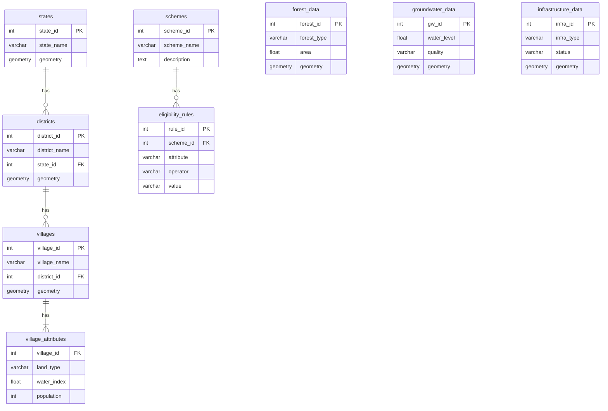

# DSS Database Optimization Plan

This document outlines the plan for optimizing the database for the Decision Support System (DSS).

## 1. Proposed Database Schema

A normalized database schema will be used to store the data.

**Schema Diagram:**

## 2. Performance Optimization with a Materialized View

To ensure the DSS is fast and responsive, a materialized view called `village_dss_data` will be created.

**Materialized View (`village_dss_data`) Structure:**

*   `village_id`
*   `village_name`
*   `district_name`
*   `state_name`
*   `geometry`
*   `land_type`
*   `water_index`
*   `population`
*   `has_forest`
*   `forest_area_percentage`
*   `nearest_groundwater_level`
*   `nearest_groundwater_quality`
*   `has_road_access`
*   `distance_to_canal`
*   ...and other relevant pre-computed attributes.

## 3. Implementation Steps

1.  **Data Loading:** Load raw data into the tables defined in the schema.
2.  **Materialized View Creation:** Create the `village_dss_data` materialized view.
3.  **DSS Queries:** The DSS will primarily query the `village_dss_data` materialized view.
4.  **Data Refresh:** Set up a periodic job to refresh the materialized view.